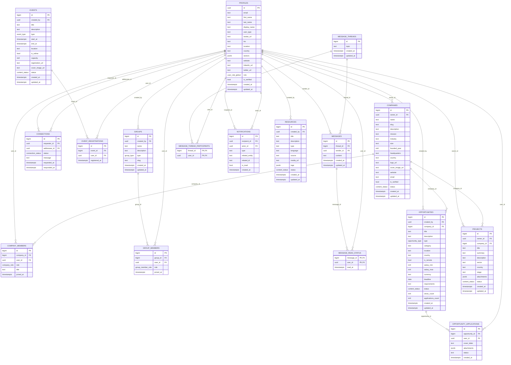

# Supabase — Dictionnaire de données complet

Projet: `peva`  
Project ID: `vvmahjuwrswdnaugsmcz`  
URL: `https://vvmahjuwrswdnaugsmcz.supabase.co`  
Généré le: 2025-09-19 23:52:58 UTC

- Variables d’environnement pertinentes: `VITE_SUPABASE_URL`, `VITE_SUPABASE_ANON_KEY`, `SUPABASE_SERVICE_ROLE_KEY` (backend only)

---

## Diagramme ER (Mermaid)



---

## Légende
- PK = Primary Key
- FK = Foreign Key
- Enum = type énuméré (voir section "Enums")

---

## Schéma `public` — Tables détaillées

Chaque table liste: colonnes (type, null, défaut), clés/contraintes, index, RLS et policies.

### `public.audit_logs`
- RLS: désactivé
- PK: `audit_logs_pkey(id)`
- Colonnes:
  - `id` bigint NOT NULL DEFAULT nextval('audit_logs_id_seq')
  - `actor_id` uuid NULL
  - `action` text NOT NULL
  - `target_entity` text NULL
  - `target_id` text NULL
  - `payload` jsonb NULL
  - `created_at` timestamptz NOT NULL DEFAULT now()
- Index: `audit_logs_pkey`
- FKs:
  - `actor_id` → `public.profiles(id)`

### `public.companies`
- RLS: activé
- PK/UNIQUE: `companies_pkey(id)`, `companies_name_key(name)`, `companies_slug_key(slug)`
- Colonnes: voir diagramme ci-dessus (défauts: `status='draft'`, `is_verified=false`, timestamps `now()`)
- Indexes:
  - `companies_pkey`, `companies_name_key`, `companies_slug_key`
- FKs:
  - `owner_id` → `public.profiles(id)`
- Policies (extraits):
  - SELECT (public): voir brouillons si membre admin/editor
  - UPDATE (public): si membre admin/editor
  - DELETE (public): admin seulement
  - SELECT (public): tout le monde voit `status='published'`

### `public.company_members`
- RLS: activé
- PK/UNIQUE: `company_members_pkey(id)`, `company_members_company_id_user_id_key(company_id,user_id)`
- Colonnes: voir diagramme
- FKs: `company_id` → `companies(id)`, `user_id` → `profiles(id)`

### `public.connections`
- RLS: désactivé
- PK/UNIQUE: `connections_pkey(id)`, `connections_requester_id_addressee_id_key`
- Colonnes: voir diagramme (défaut `status='pending'`, timestamps)
- FKs: `requester_id` → `profiles(id)`, `addressee_id` → `profiles(id)`

### `public.event_registrations`
- RLS: désactivé
- PK/UNIQUE: `event_registrations_pkey(id)`, `event_registrations_event_id_user_id_key`
- Colonnes: voir diagramme
- FKs: `event_id` → `events(id)`, `user_id` → `profiles(id)`

### `public.events`
- RLS: désactivé
- PK: `events_pkey(id)`
- Colonnes: voir diagramme (défauts: `is_online=false`, `status='published'`, timestamps)
- FKs: `created_by` → `profiles(id)`

### `public.favorites`
- RLS: désactivé
- PK/UNIQUE: `favorites_pkey(id)`, `favorites_user_id_entity_type_entity_id_key`
- Colonnes: voir diagramme (timestamp `created_at`)
- FKs: `user_id` → `profiles(id)`

### `public.forum_categories`
- RLS: désactivé
- PK/UNIQUE: `forum_categories_pkey(id)`, `forum_categories_name_key`, `forum_categories_slug_key`

### `public.forum_posts`
- RLS: désactivé
- PK: `forum_posts_pkey(id)`
- FKs: `topic_id` → `forum_topics(id)`, `user_id` → `profiles(id)`

### `public.forum_topics`
- RLS: désactivé
- PK: `forum_topics_pkey(id)`
- FKs: `category_id` → `forum_categories(id)`, `user_id` → `profiles(id)`

### `public.group_members`
- RLS: désactivé
- PK/UNIQUE: `group_members_pkey(id)`, `group_members_group_id_user_id_key`
- FKs: `group_id` → `groups(id)`, `user_id` → `profiles(id)`

### `public.groups`
- RLS: désactivé
- PK: `groups_pkey(id)`
- FKs: `created_by` → `profiles(id)`

### `public.message_read_status`
- RLS: désactivé
- PK: `message_read_status_pkey(message_id,user_id)`
- FKs: `message_id` → `messages(id)`, `user_id` → `profiles(id)`

### `public.message_thread_participants`
- RLS: désactivé
- PK: `(thread_id,user_id)`
- FKs: `thread_id` → `message_threads(id)`, `user_id` → `profiles(id)`

### `public.message_threads`
- RLS: désactivé
- PK: `message_threads_pkey(id)`

### `public.messages`
- RLS: activé
- PK: `messages_pkey(id)`
- FKs: `thread_id` → `message_threads(id)`, `sender_id` → `profiles(id)`
- Policies (extraits):
  - `ALL` (public): accès limité aux threads où l’utilisateur participe

### `public.notifications`
- RLS: désactivé
- PK: `notifications_pkey(id)`
- FKs: `recipient_id` → `profiles(id)`, `actor_id` → `profiles(id)`

### `public.opportunities`
- RLS: désactivé
- PK: `opportunities_pkey(id)`
- FKs: `created_by` → `profiles(id)`, `company_id` → `companies(id)`

### `public.opportunity_applications`
- RLS: activé
- PK/UNIQUE: `opportunity_applications_pkey(id)`, `opportunity_applications_opportunity_id_user_id_key`
- FKs: `opportunity_id` → `opportunities(id)`, `user_id` → `profiles(id)`

### `public.profiles`
- RLS: activé
- PK/UNIQUE: `profiles_pkey(id)`, `profiles_email_key(email)`
- FKs: `id` → `auth.users(id)`
- Policies (extraits):
  - SELECT (public): tout le monde
  - UPDATE (public): utilisateur peut modifier son propre profil (`id = auth.uid()`)

### `public.projects`
- RLS: désactivé
- PK: `projects_pkey(id)`
- FKs: `owner_id` → `profiles(id)`, `company_id` → `companies(id)`

### `public.resources`
- RLS: désactivé
- PK: `resources_pkey(id)`
- FKs: `created_by` → `profiles(id)`

---

## Schéma `storage` — Aperçu

### `storage.buckets`
- RLS: activé
- PK: `buckets_pkey(id)`
- Index: `bname(name)`

### `storage.objects`
- RLS: activé
- PK: `objects_pkey(id)`
- Index: `bucketid_objname`, `idx_objects_bucket_id_name`, `name_prefix_search`
- FKs: `bucket_id` → `storage.buckets(id)`
- Policies (extraits): INSERT/SELECT/UPDATE/DELETE conditionnelles sur `bucket_id` et `name` (cf. règles listées)

---

## Schéma `auth` — Aperçu
- Tables principales: `users`, `identities`, `sessions`, etc. (PKs/Indexes standards de Supabase Auth)
- RLS: généralement activé sur la plupart des tables Auth (voir liste RLS)

---

## Enums
- `public.company_role`: `admin|editor|contributor|viewer`
- `public.connection_status`: `pending|accepted|declined|blocked`
- `public.content_status`: `draft|in_review|published|archived|rejected`
- `public.event_type`: `conference|workshop|webinar|networking|competition`
- `public.group_member_role`: `member|moderator|owner`
- `public.group_type`: `public|private`
- `public.opportunity_type`: `job|internship|contract|funding|partnership|tender`
- `public.user_role_global`: `user|moderator|admin|super_admin`

(Enums supplémentaires côté `auth` et `realtime` présents, voir export interne.)

---

## Index complets (extraits)

Les principaux index/unique keys sur `public.*`:
- `companies_slug_key`, `companies_name_key`, `company_members_company_id_user_id_key`, `connections_requester_id_addressee_id_key`,
  `event_registrations_event_id_user_id_key`, `favorites_user_id_entity_type_entity_id_key`, `forum_categories_name_key`, `forum_categories_slug_key`,
  `group_members_group_id_user_id_key`, `message_read_status_pkey`, `message_thread_participants_pkey`, `profiles_email_key`,
  `opportunity_applications_opportunity_id_user_id_key`, etc.

La liste complète et exacte de tous les index est disponible dans la section Index (pg_indexes) de l’instance.

---

## RLS — Synthèse par table (public)

- Activé: `companies`, `company_members`, `messages`, `opportunity_applications`, `profiles`
- Désactivé: `audit_logs`, `connections`, `event_registrations`, `events`, `favorites`, `forum_categories`, `forum_posts`, `forum_topics`, `group_members`, `groups`, `message_read_status`, `message_thread_participants`, `message_threads`, `notifications`, `opportunities`, `projects`, `resources`

Pour chaque table RLS activée, voir la section table ci-dessus pour les policies connues.

---

## Remarques
- Ce document est généré automatiquement à partir des métadonnées de Postgres (information_schema / pg_catalog) et des APIs Supabase.
- Si tu veux, je peux ajouter un script Node pour régénérer ce document (utile en CI) et détecter les dérives de schéma.

---

## RLS — Export complet par table

Ci-dessous, l’export exhaustif des policies RLS retournées par l’instance, groupées par table. Le champ `qual` correspond à la condition USING et `with_check` à la condition WITH CHECK.

### `public.companies`
```sql
-- SELECT (public): voir brouillons si membre admin/editor
CREATE POLICY "Les membres 'admin' ou 'editor' peuvent voir les brouillons"
ON public.companies FOR SELECT TO public
USING (is_company_member(id, auth.uid(), ARRAY['admin'::company_role, 'editor'::company_role]));

-- UPDATE (public): si membre admin/editor
CREATE POLICY "Les membres 'admin' ou 'editor' peuvent mettre à jour l'entrep"
ON public.companies FOR UPDATE TO public
USING (is_company_member(id, auth.uid(), ARRAY['admin'::company_role, 'editor'::company_role]));

-- DELETE (public): admin seulement
CREATE POLICY "Seuls les admins de l'entreprise peuvent la supprimer"
ON public.companies FOR DELETE TO public
USING (is_company_member(id, auth.uid(), ARRAY['admin'::company_role]));

-- SELECT (public): tout le monde voit les publiées
CREATE POLICY "Tout le monde peut voir les entreprises publiées"
ON public.companies FOR SELECT TO public
USING (status = 'published'::content_status);
```

### `public.messages`
```sql
-- Accès restreint aux threads où l'utilisateur est participant
CREATE POLICY "Les utilisateurs peuvent accéder à leurs propres messages"
ON public.messages FOR ALL TO public
USING (
  thread_id IN (
    SELECT message_thread_participants.thread_id
    FROM message_thread_participants
    WHERE message_thread_participants.user_id = auth.uid()
  )
);
```

### `public.profiles`
```sql
-- Lecture ouverte
CREATE POLICY "Les utilisateurs peuvent voir tous les profils"
ON public.profiles FOR SELECT TO public
USING (true);

-- Mise à jour par l'utilisateur sur son propre profil
CREATE POLICY "Les utilisateurs peuvent mettre à jour leur propre profil"
ON public.profiles FOR UPDATE TO public
USING (id = auth.uid());
```

### `storage.objects`
```sql
-- Upload public (bucket peva-public)
CREATE POLICY "Allow authenticated users to upload to public bucket"
ON storage.objects FOR INSERT TO authenticated
WITH CHECK (bucket_id = 'peva-public');

-- Upload reports privés par admins/éditeurs d'entreprise
CREATE POLICY "Allow company admins to upload reports"
ON storage.objects FOR INSERT TO authenticated
WITH CHECK (
  bucket_id = 'peva-private'
  AND name LIKE 'company_reports/%'
  AND (
    SELECT is_company_member(((string_to_array(objects.name, '/'))[2])::bigint,
                             auth.uid(), ARRAY['admin'::company_role,'editor'::company_role])
  )
);

-- Lecture des reports par membres d’entreprise
CREATE POLICY "Allow company members to read reports"
ON storage.objects FOR SELECT TO authenticated
USING (
  bucket_id = 'peva-private'
  AND name LIKE 'company_reports/%'
  AND (
    SELECT is_company_member(((string_to_array(objects.name, '/'))[2])::bigint,
                             auth.uid(), ARRAY['admin'::company_role,'editor'::company_role,'contributor'::company_role,'viewer'::company_role])
  )
);

-- Lecture des pièces jointes de candidature par le propriétaire de l'opportunité
CREATE POLICY "Allow opportunity owner to read submitted applications"
ON storage.objects FOR SELECT TO authenticated
USING (
  bucket_id = 'peva-private'
  AND name LIKE 'opportunity_applications/%'
  AND auth.uid() = (
    SELECT opportunities.created_by
    FROM opportunities
    WHERE opportunities.id = ((string_to_array(objects.name, '/'))[2])::bigint
  )
);

-- DELETE des fichiers publics par leur propriétaire
CREATE POLICY "Allow users to DELETE their own public files"
ON storage.objects FOR DELETE TO authenticated
USING (
  bucket_id = 'peva-public'
  AND (
    (name LIKE 'avatars/%' AND auth.uid() = (regexp_replace(split_part(name,'/',2), '\\..*$', ''))::uuid)
    OR
    (name LIKE 'company_logos/%' AND is_company_member((regexp_replace(split_part(name,'/',2), '\\..*$', ''))::bigint,
         auth.uid(), ARRAY['admin'::company_role,'editor'::company_role]))
  )
);

-- UPDATE des fichiers publics par leur propriétaire
CREATE POLICY "Allow users to UPDATE their own public files"
ON storage.objects FOR UPDATE TO authenticated
USING (
  bucket_id = 'peva-public'
  AND (
    (name LIKE 'avatars/%' AND auth.uid() = (regexp_replace(split_part(name,'/',2), '\\..*$', ''))::uuid)
    OR
    (name LIKE 'company_logos/%' AND is_company_member((regexp_replace(split_part(name,'/',2), '\\..*$', ''))::bigint,
         auth.uid(), ARRAY['admin'::company_role,'editor'::company_role]))
  )
);

-- Lecture des fichiers de candidature par l'utilisateur
CREATE POLICY "Allow users to read their own application files"
ON storage.objects FOR SELECT TO authenticated
USING (
  bucket_id = 'peva-private'
  AND auth.uid() = ((string_to_array(name,'/'))[3])::uuid
);

-- Upload des fichiers de candidature par l'utilisateur
CREATE POLICY "Allow users to upload their own application files"
ON storage.objects FOR INSERT TO authenticated
WITH CHECK (
  bucket_id = 'peva-private'
  AND auth.uid() = ((string_to_array(name,'/'))[3])::uuid
);
```

> Si tu veux, je peux étendre cette section à d'autres tables (auth.*, storage.* supplémentaires) ou lister les policies par schéma.

---

## Index — Export complet par table (schéma `public`)

Voici toutes les définitions d'index retournées pour le schéma `public`, groupées par table.

### `public.companies`
```sql
CREATE UNIQUE INDEX companies_pkey ON public.companies USING btree (id);
CREATE UNIQUE INDEX companies_slug_key ON public.companies USING btree (slug);
CREATE UNIQUE INDEX companies_name_key ON public.companies USING btree (name);
```

### `public.company_members`
```sql
CREATE UNIQUE INDEX company_members_pkey ON public.company_members USING btree (id);
CREATE UNIQUE INDEX company_members_company_id_user_id_key ON public.company_members USING btree (company_id, user_id);
```

### `public.connections`
```sql
CREATE UNIQUE INDEX connections_pkey ON public.connections USING btree (id);
CREATE UNIQUE INDEX connections_requester_id_addressee_id_key ON public.connections USING btree (requester_id, addressee_id);
```

### `public.event_registrations`
```sql
CREATE UNIQUE INDEX event_registrations_pkey ON public.event_registrations USING btree (id);
CREATE UNIQUE INDEX event_registrations_event_id_user_id_key ON public.event_registrations USING btree (event_id, user_id);
```

### `public.events`
```sql
CREATE UNIQUE INDEX events_pkey ON public.events USING btree (id);
```

### `public.favorites`
```sql
CREATE UNIQUE INDEX favorites_pkey ON public.favorites USING btree (id);
CREATE UNIQUE INDEX favorites_user_id_entity_type_entity_id_key ON public.favorites USING btree (user_id, entity_type, entity_id);
```

### `public.forum_categories`
```sql
CREATE UNIQUE INDEX forum_categories_pkey ON public.forum_categories USING btree (id);
CREATE UNIQUE INDEX forum_categories_name_key ON public.forum_categories USING btree (name);
CREATE UNIQUE INDEX forum_categories_slug_key ON public.forum_categories USING btree (slug);
```

### `public.forum_posts`
```sql
CREATE UNIQUE INDEX forum_posts_pkey ON public.forum_posts USING btree (id);
```

### `public.forum_topics`
```sql
CREATE UNIQUE INDEX forum_topics_pkey ON public.forum_topics USING btree (id);
```

### `public.group_members`
```sql
CREATE UNIQUE INDEX group_members_pkey ON public.group_members USING btree (id);
CREATE UNIQUE INDEX group_members_group_id_user_id_key ON public.group_members USING btree (group_id, user_id);
```

### `public.groups`
```sql
CREATE UNIQUE INDEX groups_pkey ON public.groups USING btree (id);
```

### `public.message_read_status`
```sql
CREATE UNIQUE INDEX message_read_status_pkey ON public.message_read_status USING btree (message_id, user_id);
```

### `public.message_thread_participants`
```sql
CREATE UNIQUE INDEX message_thread_participants_pkey ON public.message_thread_participants USING btree (thread_id, user_id);
```

### `public.message_threads`
```sql
CREATE UNIQUE INDEX message_threads_pkey ON public.message_threads USING btree (id);
```

### `public.messages`
```sql
CREATE UNIQUE INDEX messages_pkey ON public.messages USING btree (id);
```

### `public.notifications`
```sql
CREATE UNIQUE INDEX notifications_pkey ON public.notifications USING btree (id);
```

### `public.opportunities`
```sql
CREATE UNIQUE INDEX opportunities_pkey ON public.opportunities USING btree (id);
```

### `public.opportunity_applications`
```sql
CREATE UNIQUE INDEX opportunity_applications_pkey ON public.opportunity_applications USING btree (id);
CREATE UNIQUE INDEX opportunity_applications_opportunity_id_user_id_key ON public.opportunity_applications USING btree (opportunity_id, user_id);
```

### `public.profiles`
```sql
CREATE UNIQUE INDEX profiles_pkey ON public.profiles USING btree (id);
CREATE UNIQUE INDEX profiles_email_key ON public.profiles USING btree (email);
```

### `public.projects`
```sql
CREATE UNIQUE INDEX projects_pkey ON public.projects USING btree (id);
```

### `public.resources`
```sql
CREATE UNIQUE INDEX resources_pkey ON public.resources USING btree (id);
```

---

## Index — Extraits supplémentaires (schémas `storage`, `auth`)

### `storage.buckets`
```sql
CREATE UNIQUE INDEX buckets_pkey ON storage.buckets USING btree (id);
CREATE UNIQUE INDEX bname ON storage.buckets USING btree (name);
```

### `storage.objects`
```sql
CREATE UNIQUE INDEX objects_pkey ON storage.objects USING btree (id);
CREATE UNIQUE INDEX bucketid_objname ON storage.objects USING btree (bucket_id, name);
CREATE INDEX idx_objects_bucket_id_name ON storage.objects USING btree (bucket_id, name COLLATE "C");
CREATE INDEX name_prefix_search ON storage.objects USING btree (name text_pattern_ops);
```

### `auth.*` (sélection)
```sql
CREATE UNIQUE INDEX users_pkey ON auth.users USING btree (id);
CREATE UNIQUE INDEX identities_pkey ON auth.identities USING btree (id);
CREATE UNIQUE INDEX identities_provider_id_provider_unique ON auth.identities USING btree (provider_id, provider);
CREATE UNIQUE INDEX sessions_pkey ON auth.sessions USING btree (id);
-- ... autres index standards d'Auth (voir pg_indexes)
```

> Besoin du dump complet pour tous les schémas ? Je peux étendre cette section à l'intégralité des entrées de `pg_indexes`.

---

## RLS — Export complémentaire pour `auth.*`

La requête sur `pg_policies` n'a retourné aucune policy explicite pour le schéma `auth` au moment de l'export. Cela est attendu sur Supabase: l'authentification gère souvent l'accès via des vues, des fonctions et des mécanismes internes, avec `relrowsecurity` activé sur plusieurs tables.

- État RLS (rappel): la plupart des tables `auth` ont RLS activé (voir section "RLS — Synthèse" ci-dessus).
- Policies explicites: aucune entrée renvoyée par `pg_policies` pour `auth.*` lors de cet export.

Si tu le souhaites, je peux dresser une liste détaillée table par table (`auth.users`, `auth.identities`, etc.) avec le statut RLS et les colonnes, et inclure tout objet (vues/règles) pertinent.

---

## Storage — Inventaire des buckets et contexte RLS

Voici les buckets détectés dans `storage.buckets` et leurs attributs clés:

- `peva-private`
  - public: `false`
  - avif_autodetection: `false`
  - file_size_limit: `null`
  - allowed_mime_types: `null`

- `peva-public`
  - public: `true`
  - avif_autodetection: `false`
  - file_size_limit: `null`
  - allowed_mime_types: `null`

Contexte RLS:
- `storage.objects` possède plusieurs policies RLS (voir section RLS ci-dessus) gouvernant INSERT/SELECT/UPDATE/DELETE selon `bucket_id` et le chemin `name`.
- `storage.buckets`: aucune policy explicite n'a été renvoyée par `pg_policies` lors de l'export. Les opérations sur les buckets sont généralement réservées aux rôles élevés et à l'administration (service key) plutôt qu'au client.

Si tu veux, je peux ajouter une matrice permissions/buckets résumant quelles routes (upload, read, delete) sont autorisées par bucket et par rôle.

---

## Schéma `auth` — Tables détaillées (colonnes et statut RLS)

> Exporté via information_schema et pg_class. `RLS` indique si Row Level Security est activé sur la table.

### `auth.audit_log_entries` (RLS: activé)
- Colonnes:
  - `instance_id` uuid NULL
  - `id` uuid NOT NULL
  - `payload` json NULL
  - `created_at` timestamptz NULL
  - `ip_address` varchar NOT NULL DEFAULT ''

### `auth.flow_state` (RLS: activé)
- Colonnes: `id` uuid, `user_id` uuid NULL, `auth_code` text, `code_challenge_method` code_challenge_method, `code_challenge` text, `provider_type` text, `provider_access_token` text NULL, `provider_refresh_token` text NULL, `created_at` timestamptz NULL, `updated_at` timestamptz NULL, `authentication_method` text, `auth_code_issued_at` timestamptz NULL

### `auth.identities` (RLS: activé)
- Colonnes: `provider_id` text, `user_id` uuid, `identity_data` jsonb, `provider` text, `last_sign_in_at` timestamptz NULL, `created_at` timestamptz NULL, `updated_at` timestamptz NULL, `email` text NULL, `id` uuid DEFAULT gen_random_uuid()

### `auth.instances` (RLS: activé)
- Colonnes: `id` uuid, `uuid` uuid NULL, `raw_base_config` text NULL, `created_at` timestamptz NULL, `updated_at` timestamptz NULL

### `auth.mfa_amr_claims` (RLS: activé)
- Colonnes: `session_id` uuid, `created_at` timestamptz, `updated_at` timestamptz, `authentication_method` text, `id` uuid

### `auth.mfa_challenges` (RLS: activé)
- Colonnes: `id` uuid, `factor_id` uuid, `created_at` timestamptz, `verified_at` timestamptz NULL, `ip_address` inet, `otp_code` text NULL, `web_authn_session_data` jsonb NULL

### `auth.mfa_factors` (RLS: activé)
- Colonnes: `id` uuid, `user_id` uuid, `friendly_name` text NULL, `factor_type` factor_type, `status` factor_status, `created_at` timestamptz, `updated_at` timestamptz, `secret` text NULL, `phone` text NULL, `last_challenged_at` timestamptz NULL, `web_authn_credential` jsonb NULL, `web_authn_aaguid` uuid NULL

### `auth.oauth_clients` (RLS: désactivé)
- Colonnes: `id` uuid, `client_id` text, `client_secret_hash` text, `registration_type` oauth_registration_type, `redirect_uris` text, `grant_types` text, `client_name` text NULL, `client_uri` text NULL, `logo_uri` text NULL, `created_at` timestamptz DEFAULT now(), `updated_at` timestamptz DEFAULT now(), `deleted_at` timestamptz NULL

### `auth.one_time_tokens` (RLS: activé)
- Colonnes: `id` uuid, `user_id` uuid, `token_type` one_time_token_type, `token_hash` text, `relates_to` text, `created_at` timestamptz NULL, `updated_at` timestamptz NULL

### `auth.refresh_tokens` (RLS: activé)
- Colonnes: `id` uuid, `session_id` uuid, `created_at` timestamptz NULL, `updated_at` timestamptz NULL, `parent` text NULL, `session_id` duplicate? (voir schéma réel), `not_after` timestamptz NULL

### `auth.saml_providers` (RLS: activé)
- Colonnes: `id` uuid, `entity_id` text, `metadata_xml` text NULL, `created_at` timestamptz NULL, `updated_at` timestamptz NULL, `name_id_format` text NULL

### `auth.saml_relay_states` (RLS: activé)
- Colonnes: `id` uuid, `sso_provider_id` uuid, `request_id` text, `for_email` text NULL, `redirect_to` text NULL, `created_at` timestamptz NULL, `updated_at` timestamptz NULL, `flow_state_id` uuid NULL

### `auth.schema_migrations` (RLS: activé)
- Colonnes: `version` varchar

### `auth.sessions` (RLS: activé)
- Colonnes: `id` uuid, `user_id` uuid, `created_at` timestamptz NULL, `updated_at` timestamptz NULL, `factor_id` uuid NULL, `aal` aal_level NULL, `not_after` timestamptz NULL, `refreshed_at` timestamp NULL, `user_agent` text NULL, `ip` inet NULL, `tag` text NULL

### `auth.sso_domains` (RLS: activé)
- Colonnes: `id` uuid, `sso_provider_id` uuid, `domain` text, `created_at` timestamptz NULL, `updated_at` timestamptz NULL

### `auth.sso_providers` (RLS: activé)
- Colonnes: `id` uuid, `resource_id` text NULL, `created_at` timestamptz NULL, `updated_at` timestamptz NULL, `disabled` bool NULL

### `auth.users` (RLS: activé)
- Colonnes: nombreuses colonnes standard d’auth (id, email, phone, meta, timestamps, etc.). Voir export détaillé dans la section Index/Enums et le schéma Supabase par défaut.

> Note: Le schéma `auth` est géré par Supabase; modifier les policies/structures doit se faire avec précaution.

---

## Storage — Matrice de permissions par bucket (dérivée des policies)

| Bucket        | Action  | Rôle/Condition                           | Règle (résumé) |
|---------------|---------|------------------------------------------|----------------|
| peva-public   | READ    | public (par défaut via URL signée/non)   | Non couvert par policy explicite; lecture publique si bucket public |
| peva-public   | UPLOAD  | authenticated                            | Allow authenticated users to upload to public bucket |
| peva-public   | UPDATE  | authenticated + propriétaire du fichier  | UPDATE own public files (avatars/% or company_logos/%) |
| peva-public   | DELETE  | authenticated + propriétaire du fichier  | DELETE own public files (avatars/% or company_logos/%) |
| peva-private  | READ    | authenticated + propriétaire app file    | Read own application files (opportunity_applications/% ... uid in path) |
| peva-private  | READ    | authenticated + owner de l'opportunité   | Opportunity owner can read submitted applications |
| peva-private  | READ    | authenticated + membre d’entreprise      | Read company reports (company_reports/% + is_company_member) |
| peva-private  | UPLOAD  | authenticated + propriétaire app file    | Upload own application files (path contains own uid) |
| peva-private  | UPLOAD  | authenticated + admin/editor entreprise  | Upload company reports (is_company_member with admin/editor) |
| peva-private  | UPDATE  | (non défini explicitement)               | S’appuie sur policies existantes; ajouter si besoin |
| peva-private  | DELETE  | (non défini explicitement)               | S’appuie sur policies existantes; ajouter si besoin |

> Les actions non listées explicitement héritent du comportement par défaut (refusées si aucune policy ne les autorise sous RLS). Pour des besoins spécifiques (ex: DELETE pour company_reports), je peux écrire des policies supplémentaires.
